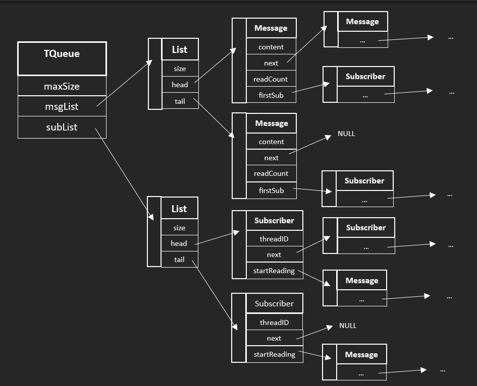
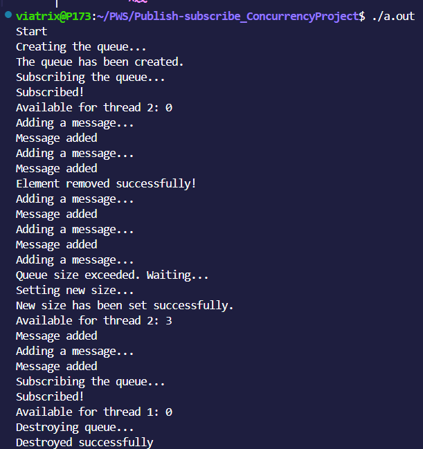

Projekt jest dostępny w repozytorium pod adresem:  
<https://github.com/viatrix17/Publish-subscribe_ConcurrencyProject>


# Struktury danych

1. Elementy listy definiowane są strukturą `List`:

    ```C
    typedef struct List {
        int size;
        void* head;
        void* tail;
    }List;
    ```
    Zmienne `head` i `tail` wskazują odpowiednio na: początek i koniec listy, a zmienna `size` przechowuje rozmiar listy.
    
2. Wiadomości definiowane są strukturą `Message`:

    ```C
    typedef struct Message {
        void* content;
        struct Message* next;
        int readCount;
        struct Subscriber* firstSub; 
    }Message;
    ```
    Zmienna `content` przechowuje treść wiadomości (wskaźnik na wskazany przez użytkownika obszar pamięci); zmienna `next` jest wskaźnikiem na następną wiadomość; zmienna `readCount` przechowuje liczbę subskrybentów, którzy nie przeczytali jeszcze tej wiadomości; zmienna `firstSub` jest wskaźnikiem na pierwszego subskrybenta, który będzie czytać tę wiadomość.

3. Subskrybenci definiowani są strukturą `Subscriber`:

    ```C
    typedef struct Subscriber {
        pthread_t* threadID;
        struct Subscriber* next;
        Message* startReading;
    }Subscriber;
    ```
    Zmienna `threadID` wskazuje na identyfikator wątku; zmienna `next` wskazuje na następnego subskrybenta; zmienna `startReading` wskazuje na pierwszą wiadomość, która ma być przeczytana przez ten wątek.

4. Kolejka definiowana jest strukturą `TQueue`:

    ```C
    typedef struct TQueue {
        int maxSize;
        List* msgList;
        List* subList;
        pthread_mutex_t* access_mutex;
        pthread_mutex_t* operation_mutex;
        pthread_cond_t* block_operation;
    }TQueue;
    ```
    Zmienna `maxSize` przechowuje informacje o maksymalnym rozmiarze kolejki, zmienne `msgList` i `subList` to odpowiednio: lista wiadomości w kolejce i lista subskrybentów kolejki; `access_mutex` to zamek do synchronizacji odczytu i zapisu; zamek `operation_mutex` i zmienna warunkowa `block_operation` służą do blokowania wątków, kiedy kolejka jest pełna lub lista wiadomości subskrybenta jest pusta.
    
# Funkcje

1. `void delMsg(TQueue *queue, Message* msg)` -- usuwanie wiadomości i budzenie wątków, czekających na zwolnienie miejsca w kolejce.
2. `void checkMsg(TQueue* queue, Message* msg)` -- aktualizacja zmiennej `readCount` dla wszystkich wiadomość, które miały być przeczytane przez wątek, który wywołał funkcję `unsubscribe()`i sprawdzanie, czy można tą wiadomość usunąć


# Opis

Program implementuje system Publish-subscribe opisany w skrypcie.

Wizualizacja struktury:


Oczywiście zmienne `firstSub` oraz `startReading` mogą wskazywać na `NULL` jednak nie zamieściłam tego w wizualizacji dla przejrzystości.

Sprawdzone zostały sytuacje skrajne:
* dodanie wiadomości do pustej kolejki -> natychmiastowe usunięcie wiadomości
* dodanie wiadomości do pełnej kolejki -> wątek czeka, aż zwolni się miejsce
* próba ponownego zasubskrybowania kolejki przez ten sam wątek -> informacja o tym, że wątek subskrybuje już kolejkę i wyjście z funkcji
* pobieranie wiadomości przez wątek, który nie subskrybuje kolejki -> zwrócenie wartości NULL
* pobieranie wiadomośći przez wątek, którego lista wiadomości do odczytania jest pusta -> wątek czeka, aż jakaś wiadomość zostanie dodana do kolejki
* zmniejszanie/powiększanie rozmiaru kolejki funkcją `setSize()` -> jeśli nowy rozmiar jest mniejszy niż obecny rozmiar, to usuwane są pierwsze wiadomości z kolejki, aby osiągnąć pożądany rozmiar; jeśli nowy rozmiar jest większy niż obecny maksymalny rozmiar, to wtedy budzone są watki, które czekają na zwolnienie miejsca w kolejce
* koniec subskrybcji -> wiadomości, które były na liscie wiadomości do przeczytania zostają oznaczone jako przeczytane przez ten wątek


Odporność na *zakleszczenie*: 
* Zamek `acces_mutex` jest zawsze zajmowany przed zamkiem `operation_mutex`, więc wątki nie będą czekać na zwolnienie zamków przez siebie nawzajem.
* Nie ma sytuacji, w której wątki czekają na zasoby, które sobie wzajemnie nieskończenie długo blokują. Jeśli wątek zablokuje się na funkcji `addMsg()`, kiedy kolejka jest pełna, to funkcja `getMsg()` dla jakiegoś wątku zwolni miejsce w kolejce, ewentualnie zrobi to funkcja `removeMsg()` albo `unsubscribe()`, więc da się z potencjalnego zakleszczenia wyjść. Natomiast jeśli wątek zablokuje się na funkcji `getMsg()`, kiedy lista wiadomości do przeczytania dla danego wątku jest pusta, to wtedy inny wątek, wywołujac `addMsg()` doda wiadomość i odblokuje pierwszy wątek. Ścieżka potrzebnych zasobów się nie zapętla. 

Odporność na *aktywne czekanie*: 
* Użycie zamków zapewnia wzajemne wykluczanie, a wątki się blokują lub czekają na zwolnienie zamka zamiast ciągłego sprawdzania, czy mogą wykonać daną operację, 
* Użycie zmiennej warunkowej `block_operation` pozwala uniknąć aktywnego czekania, ponieważ zamek `operation_mutex` chroniący tą zmienną warunkową jest zwalniany, kiedy zmienna czeka na sygnał budzący wątek.

Odporność na *głodzenie*: 
* Użycie `pthread_cond_signal()` dla zasygnalizowania, że zwolniło się miejsce w kolejce, budzi wątek, który jako pierwszy zasnął, więc nie będzie on zagłodzony. 
* Użycie `pthread_cond_broadcast()` przy dodawaniu wiadomości budzi czekających subskrybentów w momencie dodania nowej wiadomości, przez co nie czekają, kiedy nie trzeba.

# Przykład użycia




